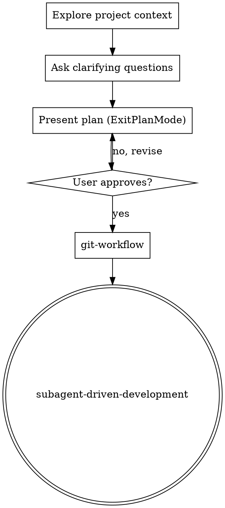

# Brainstorming Ideas Into Plans

## Trigger

Activate when:
- The user enters Plan mode
- The user describes a new feature, task, or change to implement
- Any creative/implementation work is about to begin

Do not start writing code until a plan has been presented and the user has approved it.

## Checklist

Complete in order:

1. **Explore project context** — check files, docs, recent commits
2. **Ask clarifying questions** — one at a time via `AskUserQuestion`, understand purpose/constraints/success criteria
3. **Present the plan via `ExitPlanMode`** — concrete implementation steps. The tool renders the plan in the IDE's native approval widget. If the user rejects, revise and call `ExitPlanMode` again.
4. **Hand off to implementation** — once the plan is approved, invoke `git-workflow` to set up a branch, then `subagent-driven-development` to execute the plan. Do NOT start writing code inline in this session.

## Process Flow

## The Process

**Understanding the idea:**
- Check the current project state first (files, docs, recent commits)
- Ask clarifying questions via `AskUserQuestion` — renders an interactive picker in the IDE instead of a wall of chat text
- Prefer multiple choice (2-4 concrete options + "Other" for free-form) — faster to answer than open-ended
- One question per `AskUserQuestion` call. Break topics into multiple sequential questions if needed
- Focus on: purpose, constraints, success criteria
- Skip questions entirely if the task is already unambiguous

**Presenting the plan:**
- Once intent is clear, call `ExitPlanMode` with the plan as its argument — this renders the native plan-approval widget in the IDE (separate window, not inline chat text)
- The plan should cover: what files change, what the behavior will be, how it's tested
- Scale detail to complexity — a few bullets for small changes, more structure for larger ones
- If the user rejects or requests changes, revise and call `ExitPlanMode` again. No separate design doc file, no section-by-section approval — one widget, iterate until approved
- For architecturally-significant decisions (new dependencies, data model changes, service boundaries), the `adr-architect` skill handles the heavyweight process

## Key Principles

- **Use `AskUserQuestion` for every question** — interactive picker, not chat text
- **One question at a time** — don't overwhelm
- **Multiple choice preferred** — easier to answer
- **YAGNI ruthlessly** — strip unnecessary scope
- **Be flexible** — go back and clarify when something doesn't fit
