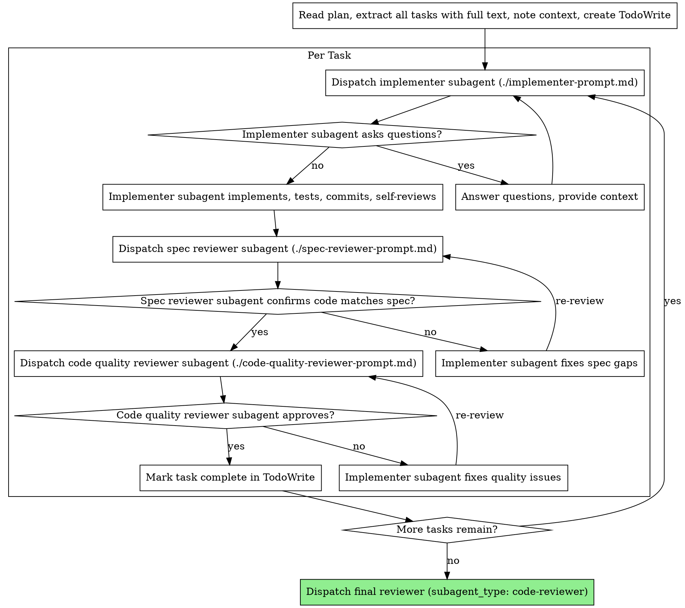

# Subagent-Driven Development

Execute plan by dispatching fresh subagent per task, with two-stage review after each: spec compliance review first, then code quality review.

**Core principle:** Fresh subagent per task + two-stage review (spec then quality) = high quality, fast iteration

## When to Use

This skill is the bridge between planning and implementation. It is MANDATORY per the workflow-pipeline rule. Once Plan mode is exited and git-workflow has created a branch, this skill takes over.

Trigger when:
- Plan mode has been exited and a plan exists
- git-workflow has already created a branch
- The user says "let's build this", "implement the plan", "start coding"

Do NOT use when:
- There's no plan yet (use brainstorming first)
- There's no git branch yet (use git-workflow first)

**Pre-conditions check (MANDATORY):**
1. Approved design doc exists? If not → STOP
2. Written implementation plan exists? If not → STOP
3. Git branch created by git-workflow? If not → STOP

## The Process



## Skill Selection for Subagents

Before dispatching each implementer subagent, determine which skills match the task's technology stack and list them in the prompt. The subagent must invoke these skills before writing code.

**Mapping rules:**
- `.go` files, `go.mod` → `/go-senior`
- `.py` files → `/py-senior`
- FastAPI endpoints, SQLAlchemy, Pydantic in bloomfield-api → `/fastapi-dev`
- React/Next.js/frontend components → `/frontend-design`
- Claude API / Anthropic SDK → `/claude-api`
- Library/framework questions → `/context7-mcp`

Multiple skills can apply to one task (e.g. `/py-senior` + `/fastapi-dev` for a FastAPI endpoint).

## Prompt Templates

- `./implementer-prompt.md` — implementer subagent (`subagent_type: general-purpose`)
- `./spec-reviewer-prompt.md` — spec compliance reviewer (`subagent_type: code-reviewer`)
- `./code-quality-reviewer-prompt.md` — per-task code quality reviewer (`subagent_type: code-reviewer`)

**Final reviewer (after all tasks complete):** dispatch with `subagent_type: code-reviewer`, scope = full diff from base branch to HEAD, prompt = review the entire implementation against the plan. Same agent type as the per-task reviewers, just broader scope.

## Review Loop Cap

Every reviewer → fixer → re-review cycle has a **hard limit of 2 re-reviews per task per reviewer** (spec and quality tracked separately).

- Attempt 1: reviewer flags issues → implementer fixes → re-review (attempt 1 of 2)
- Attempt 2: reviewer flags issues → implementer fixes → re-review (attempt 2 of 2)
- Attempt 3: **STOP.** Escalate to the user with: all three reviews, all three fix attempts, and a concrete question — is the remaining issue real, is the reviewer nitpicking, or should we accept and move on?

This prevents infinite ping-pong on subjective issues. The user decides.

## Example Workflow

```
You: I'm using Subagent-Driven Development to execute this plan.

[Read plan file once: docs/plans/feature-plan.md]
[Extract all 5 tasks with full text and context]
[Create TodoWrite with all tasks]

Task 1: Hook installation script

[Get Task 1 text and context (already extracted)]
[Dispatch implementation subagent with full task text + context]

Implementer: "Before I begin - should the hook be installed at user or system level?"

You: "User level (~/.config/superpowers/hooks/)"

Implementer: "Got it. Implementing now..."
[Later] Implementer:
  - Implemented install-hook command
  - Added tests, 5/5 passing
  - Self-review: Found I missed --force flag, added it
  - Committed

[Dispatch spec compliance reviewer]
Spec reviewer: ✅ Spec compliant - all requirements met, nothing extra

[Get git SHAs, dispatch code quality reviewer]
Code reviewer: Strengths: Good test coverage, clean. Issues: None. Approved.

[Mark Task 1 complete]

Task 2: Recovery modes

[Get Task 2 text and context (already extracted)]
[Dispatch implementation subagent with full task text + context]

Implementer: [No questions, proceeds]
Implementer:
  - Added verify/repair modes
  - 8/8 tests passing
  - Self-review: All good
  - Committed

[Dispatch spec compliance reviewer]
Spec reviewer: ❌ Issues:
  - Missing: Progress reporting (spec says "report every 100 items")
  - Extra: Added --json flag (not requested)

[Implementer fixes issues]
Implementer: Removed --json flag, added progress reporting

[Spec reviewer reviews again]
Spec reviewer: ✅ Spec compliant now

[Dispatch code quality reviewer]
Code reviewer: Strengths: Solid. Issues (Important): Magic number (100)

[Implementer fixes]
Implementer: Extracted PROGRESS_INTERVAL constant

[Code reviewer reviews again]
Code reviewer: ✅ Approved

[Mark Task 2 complete]

...

[After all tasks]
[Dispatch final code-reviewer]
Final reviewer: All requirements met, ready to merge

Done!
```

## Advantages

**vs. Manual execution:**
- Subagents follow TDD naturally
- Fresh context per task (no confusion)
- Parallel-safe (subagents don't interfere)
- Subagent can ask questions (before AND during work)

**vs. Executing Plans:**
- Same session (no handoff)
- Continuous progress (no waiting)
- Review checkpoints automatic

**Efficiency gains:**
- No file reading overhead (controller provides full text)
- Controller curates exactly what context is needed
- Subagent gets complete information upfront
- Questions surfaced before work begins (not after)

**Quality gates:**
- Self-review catches issues before handoff
- Two-stage review: spec compliance, then code quality
- Review loops ensure fixes actually work
- Spec compliance prevents over/under-building
- Code quality ensures implementation is well-built

**Cost:**
- More subagent invocations (implementer + 2 reviewers per task)
- Controller does more prep work (extracting all tasks upfront)
- Review loops add iterations
- But catches issues early (cheaper than debugging later)

## Red Flags

**Never:**
- Start implementation on main/master branch without explicit user consent
- Skip reviews (spec compliance OR code quality)
- Proceed with unfixed issues
- Dispatch multiple implementation subagents in parallel (conflicts)
- Make subagent read plan file (provide full text instead)
- Skip scene-setting context (subagent needs to understand where task fits)
- Ignore subagent questions (answer before letting them proceed)
- Accept "close enough" on spec compliance (spec reviewer found issues = not done)
- Skip review loops (reviewer found issues = implementer fixes = review again)
- Let implementer self-review replace actual review (both are needed)
- **Start code quality review before spec compliance is ✅** (wrong order)
- Move to next task while either review has open issues

**If subagent asks questions:**
- Answer clearly and completely
- Provide additional context if needed
- Don't rush them into implementation

**If reviewer finds issues:**
- Implementer (same subagent) fixes them
- Reviewer reviews again
- **Max 2 re-reviews per reviewer per task** — on the 3rd attempt, STOP and escalate to the user (see Review Loop Cap above)
- Don't skip the re-review

**If subagent fails task:**
- Dispatch fix subagent with specific instructions
- Don't try to fix manually (context pollution)

## Integration

**Related skills:**
- **git-workflow** — Sets up branch before this skill runs; creates PR after
- **brainstorming** — Creates the plan that this skill executes
- **code-review** — Used for the final code review subagent

**Subagents should:**
- Follow TDD when writing tests
- Use the `code-reviewer` agent type for code quality reviews
